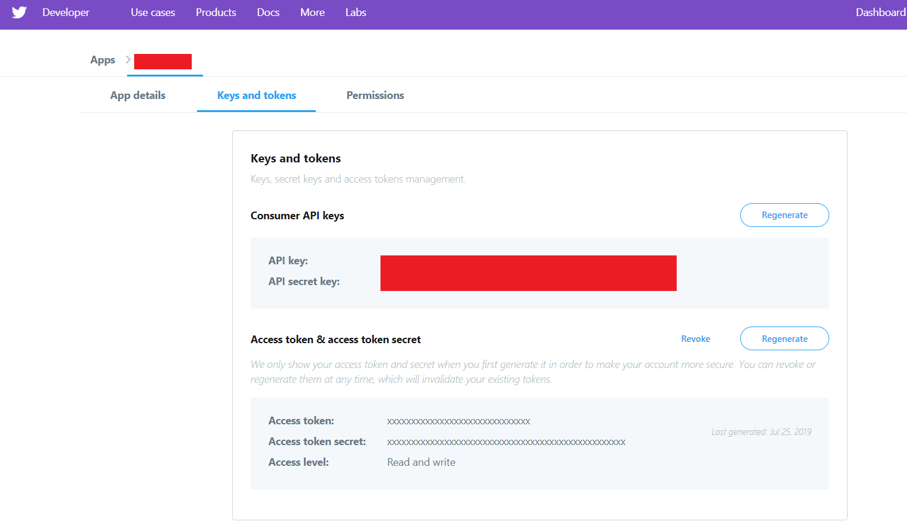

# ioBroker.twitter

[](https://www.npmjs.com/package/iobroker.twitter)
[](https://www.npmjs.com/package/iobroker.twitter)


[](https://david-dm.org/Julius278/iobroker.twitter)
[](https://snyk.io/test/github/Julius278/ioBroker.twitter)

[](https://nodei.co/npm/iobroker.twitter/)

## twitter adapter for ioBroker

Describe your project here

## Developer manual
This section is intended for the developer. It can be deleted later

### Getting started
1. First you have to create an [Twitter App](https://developer.twitter.com/en/apps/create).
2. After many steps you get the following keys and tokens:

3. Insert them in the adapter page
4. There is an "Test" button, which posts an "Hello world!" message to your timeline to proof, that it works.

### Usage
To post or get information from ScriptEngine just write: 

```
// post a tweet to your timeline via twitter adapter
sendTo("twitter", "send", "message body");
sendTo("twitter", "post", "message body");

// it's also possible to manage different accounts and post
sendTo("twitter.1", "send", "message body");
sendTo("twitter.1", "post", "message body");

// If you want to test the dummyPost (hello world) tweet
sendTo("twitter", "dummyPost");
```

## Changelog

### 0.0.1
* (Julius278) initial release

## License
MIT License

Permission is hereby granted, free of charge, to any person obtaining a copy
of this software and associated documentation files (the "Software"), to deal
in the Software without restriction, including without limitation the rights
to use, copy, modify, merge, publish, distribute, sublicense, and/or sell
copies of the Software, and to permit persons to whom the Software is
furnished to do so, subject to the following conditions:

The above copyright notice and this permission notice shall be included in all
copies or substantial portions of the Software.

THE SOFTWARE IS PROVIDED "AS IS", WITHOUT WARRANTY OF ANY KIND, EXPRESS OR
IMPLIED, INCLUDING BUT NOT LIMITED TO THE WARRANTIES OF MERCHANTABILITY,
FITNESS FOR A PARTICULAR PURPOSE AND NONINFRINGEMENT. IN NO EVENT SHALL THE
AUTHORS OR COPYRIGHT HOLDERS BE LIABLE FOR ANY CLAIM, DAMAGES OR OTHER
LIABILITY, WHETHER IN AN ACTION OF CONTRACT, TORT OR OTHERWISE, ARISING FROM,
OUT OF OR IN CONNECTION WITH THE SOFTWARE OR THE USE OR OTHER DEALINGS IN THE
SOFTWARE.# ioBroker.twitter

Copyright (c) 2021 Julius278 <iobroker@juliuslauterbach.de>